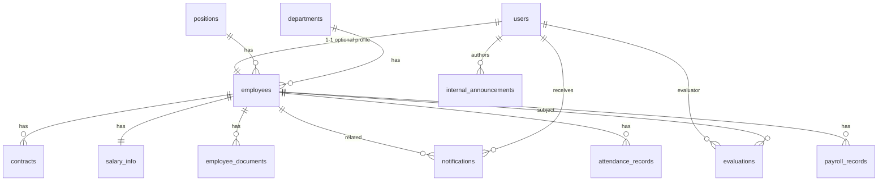

# Hệ thống HRM — Bệnh viện Minh An

Hai project tách biệt: **Spring Boot REST API** (`backend/`) và **React + Vite + MUI v5** (`frontend/`), giao tiếp qua HTTP/JSON và JWT.

**RBAC:** chỉ hai vai trò **`ADMIN`** (toàn quyền quản trị, import Excel nhân lực, đánh giá điều dưỡng, …) và **`EMPLOYEE`** (nhân viên).

## Cấu trúc thư mục

```
nhanluc/
├── backend/                 # Spring Boot 3.2, Java 17
│   ├── pom.xml
│   ├── sql/schema.sql       # Script SQL độc lập (tham chiếu cùng schema Flyway)
│   └── src/main/java/com/minhan/hrm/
│       ├── config/          # Properties, CORS, OpenAPI, seed
│       ├── controller/
│       ├── dto/
│       ├── entity/
│       ├── exception/
│       ├── mapper/
│       ├── repository/
│       ├── scheduler/       # @Scheduled — nhắc xét nâng lương
│       ├── security/        # JWT + RBAC
│       └── service/
│   └── src/main/resources/
│       ├── application.yml
│       └── db/migration/
│           ├── V1__initial_schema.sql
│           ├── V2__migrate_hr_role_to_admin.sql
│           └── V3__workforce_and_nursing_eval.sql
│       └── evaluation-templates/
│           └── dieu-duong-monthly.json   # Tiêu chí đánh giá (trích từ Excel BV)
├── frontend/                # Vite + React 18 + TypeScript + MUI 5
│   ├── package.json
│   └── src/
│       ├── components/
│       ├── context/
│       ├── layouts/
│       ├── pages/
│       ├── routes/
│       ├── services/
│       └── utils/
└── README.md
```

## Thiết kế cơ sở dữ liệu (ERD)



- **users**: tài khoản + `role` (**ADMIN** / **EMPLOYEE**). ADMIN có thể không có bản ghi **employees** (ví dụ tài khoản `admin` chỉ quản trị hệ thống).
- **employee_documents**: chỉ lưu metadata + `stored_path` trên file system (không lưu BLOB PDF trong DB).
- **payroll_records** / **attendance_records**: truy cập chặt ở tầng service (NV chỉ xem của mình; ADMIN xem rộng).

Chi tiết cột và FK: xem `backend/src/main/resources/db/migration/V1__initial_schema.sql` hoặc `backend/sql/schema.sql`.

## API endpoints (tóm tắt)

Base URL: `http://localhost:8080`. Tiền tố: `/api`. Swagger UI: `http://localhost:8080/swagger-ui.html` (khai báo Bearer token sau khi login).

| Nhóm | Method | Path | Ghi chú |
|------|--------|------|---------|
| Auth | POST | `/api/auth/login` | Public |
| Dashboard | GET | `/api/v1/dashboard/stats` | ADMIN |
| Departments | GET | `/api/v1/departments` | Authenticated |
| Positions | GET | `/api/v1/positions` | Authenticated |
| Employees | GET | `/api/v1/employees` | ADMIN (pageable) |
| Employees | GET | `/api/v1/employees/me` | Có hồ sơ NV |
| Employees | GET | `/api/v1/employees/{id}` | RBAC (tự xem / ADMIN) |
| Employees | POST | `/api/v1/employees` | ADMIN (`role` body = EMPLOYEE) |
| Employees | PUT | `/api/v1/employees/{id}` | ADMIN |
| Employees | DELETE | `/api/v1/employees/{id}` | ADMIN (vô hiệu hóa) |
| Documents | POST | `/api/v1/documents/employees/{employeeId}` | multipart `file` — PDF, ADMIN |
| Documents | GET | `/api/v1/documents/employees/{employeeId}` | Danh sách meta |
| Documents | GET | `/api/v1/documents/{id}/file` | Stream PDF |
| Notifications | GET | `/api/v1/notifications` | Của user hiện tại |
| Notifications | GET | `/api/v1/notifications/unread-count` | |
| Notifications | PATCH | `/api/v1/notifications/{id}/read` | |
| Notifications | POST | `/api/v1/notifications/adhoc` | ADMIN |
| Announcements | GET | `/api/v1/announcements` | Nội viện đang hiệu lực |
| Announcements | POST | `/api/v1/announcements` | ADMIN |
| Announcements | DELETE | `/api/v1/announcements/{id}` | ADMIN |
| Evaluations | GET | `/api/v1/evaluations/employees/{employeeId}` | RBAC |
| Evaluations | POST | `/api/v1/evaluations` | ADMIN |
| Attendance | GET | `/api/v1/attendance/employees/{employeeId}` | `from`, `to` — RBAC |
| Attendance | POST | `/api/v1/attendance` | ADMIN |
| Payroll | GET | `/api/v1/payroll/employees/{employeeId}` | RBAC |
| Payroll | GET | `/api/v1/payroll` | Toàn bộ — ADMIN |
| Payroll | POST | `/api/v1/payroll` | ADMIN |
| Payroll | DELETE | `/api/v1/payroll/{id}` | ADMIN |
| Import | POST | `/api/v1/import/workforce` | multipart `file` .xlsx — ADMIN |
| Nursing template | GET | `/api/v1/nursing-evaluations/templates/{code}` | `DIEU_DUONG_MONTHLY` |
| Nursing list | GET | `/api/v1/nursing-evaluations/employees/{employeeId}` | ADMIN hoặc chính NV |
| Nursing save | POST | `/api/v1/nursing-evaluations` | ADMIN — body scores theo từng tiêu chí |

**Excel nhân lực:** dùng đúng file dạng **TỔNG HỢP THÔNG TIN NHÂN LỰC.BVMA.xlsx** (sheet đầu, dòng 1 = tiêu đề). Cột được map vào `employees` + bảng `employee_workforce_details` (ngân hàng, CCHN, hợp đồng, phạm vi hành nghề, …). **Mã nhân viên** = khóa cập nhật; user mới có mật khẩu `minhan.hrm.import.default-employee-password` (mặc định `Minhan@123`).

**Đánh giá điều dưỡng:** mẫu tiêu chí trong `evaluation-templates/dieu-duong-monthly.json` (sinh từ **BỘ TIÊU CHÍ ĐÁNH GIÁ ĐIỀU DƯỠNG. MA.xlsx**). Mỗi tiêu chí nhập 3 cột: NV tự chấm, Trưởng khoa, ĐDT; tổng điểm → xếp loại (≥90 Xuất sắc, 80–89 Tốt, …).

## Chạy Backend

1. Cài **JDK 17**, **Maven**, **MySQL 8+**.
2. Tạo database:
   ```sql
   CREATE DATABASE minhan_hrm CHARACTER SET utf8mb4 COLLATE utf8mb4_unicode_ci;
   ```
3. Cấu hình `backend/src/main/resources/application.yml` (`spring.datasource.username` / `password`) hoặc biến môi trường `DB_USERNAME`, `DB_PASSWORD`.
4. Flyway sẽ chạy migration khi khởi động (V2 đổi `HR`→`ADMIN`; V3 thêm `employee_code`, bảng nhân lực mở rộng & đánh giá điều dưỡng).
5. Trong thư mục `backend`:
   ```bash
   mvn spring-boot:run
   ```
6. Mặc định profile **không** phải `prod` → `DataSeedRunner` tạo dữ liệu mẫu nếu bảng `users` trống:
   - `admin` / `Admin@123` (ADMIN — toàn quyền, không bắt buộc có hồ sơ NV)
   - `nhanvien` / `Emp@123` (EMPLOYEE, mã NV demo `NV-DEMO-001`)

Production: chạy với `--spring.profiles.active=prod` để tắt seed (cần tạo user/DDL qua quy trình riêng).

**JWT / upload:** `JWT_SECRET` (chuỗi đủ dài, khuyến nghị Base64 32+ byte), `UPLOAD_DIR` (thư mục lưu PDF).

## Chạy Frontend

```bash
cd frontend
npm install
npm run dev
```

Ứng dụng: `http://localhost:5173`. Vite proxy chuyển `/api` → `http://localhost:8080`.

Build production:

```bash
npm run build
```

Phục vụ thư mục `frontend/dist` bằng Nginx / CDN; cấu hình CORS trên backend cho origin thực tế (`minhan.hrm.cors.allowed-origins`).

## Code mẫu quan trọng (Backend)

- **Auth + JWT:** `security/SecurityConfig.java`, `security/JwtService.java`, `security/JwtAuthenticationFilter.java`, `service/AuthService.java`, `controller/AuthController.java`
- **Nhân viên (CRUD + RBAC):** `service/EmployeeService.java`, `controller/EmployeeController.java`, `mapper/EmployeeMapper.java`
- **Upload PDF:** `service/FileStorageService.java`, `service/EmployeeDocumentService.java`, `controller/EmployeeDocumentController.java`
- **Thông báo + lịch:** `service/NotificationService.java`, `scheduler/SalaryReviewScheduler.java`, `controller/NotificationController.java`

## Ghi chú production

- Đổi `minhan.hrm.jwt.secret`, HTTPS, harden MySQL, backup `UPLOAD_DIR`.
- Scheduler có thể tạo nhiều thông báo nếu chạy lặp; nên bổ sung idempotency theo `user_id` + khoảng ngày khi triển khai thật.
- Bật rate limit / WAF phía gateway cho `/api/auth/login`.
